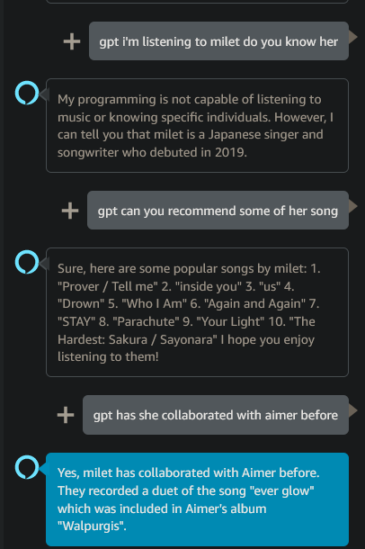

# alexa2gpt

Demo of connecting Alexa with ChatGPT via Alexa skill and ChatGPT API to have continuous conversation with memory.

## Setup
```
// configure your Amazon Developer account and AWS account
ask configure

// choose self hosted Lambda so we can add an env var for API key
ask init

cd lambda

npm install
cd ..
ask deploy
```
Once the Lambda is deployed, set your chatGPT API key as an env var of the Lambda configuration on AWS console

Afterwards, you should be able to test with Alexa simulator on Alexa developer console.

## Skill interaction
Alexa Open Chatgpt skill

gpt \<text\>


